# LTU Summer Course ST25 D7015B Industrial AI and eMaintenance
Assignment 5 - LiDAR processing 

## Ground level
The ground level was found using Kernel Density Estimation (KDE). In the dataset it is represented on the Z-axis. Algorithmically the track was seen as not-ground, while the assignment says otherwise. To solve this problem, a small heigh-margin on 0.5 was added to heigh. As such, the alsolute lowest possible heigh-value is 0+0.3=0.3 (assuming no negaive height).

Dataset 1 has the ground level at Z $\approx$ 61.35. By adding the heigh-margin of 0.3, the ground level becomes Z=61.55 $\approx$ 61.6.

72067 -> 48790 points (reduction of $\approx$ 32%)

Dataset 2 has the ground level at Z $\approx$ 61.18. By adding the heigh-margin of 0.3, the ground level becomes Z=61.48 $\approx$ 61.5.

84588 -> 65790 points (reduction of $\approx$ 22%)

As can be noted, the ground level of both datasets are very close to another and can be seen as being Z $\approx$ 61.5. This is expected as the height from the ground to the LiDAR sensor is likely the same across both datasets.
### Height distribution
#### Dataset 1
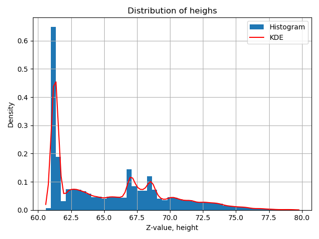

#### Dataset 2
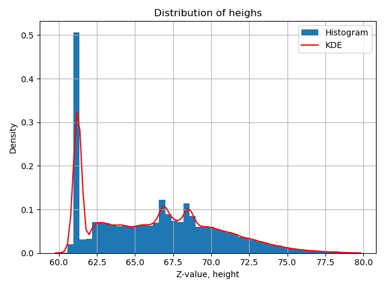

### PCD without ground
#### Dataset 1
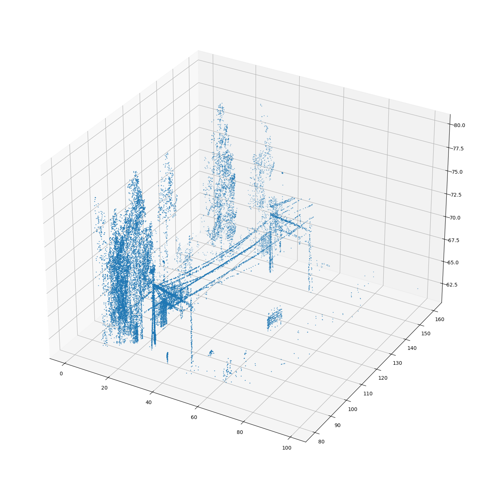

#### Dataset 2
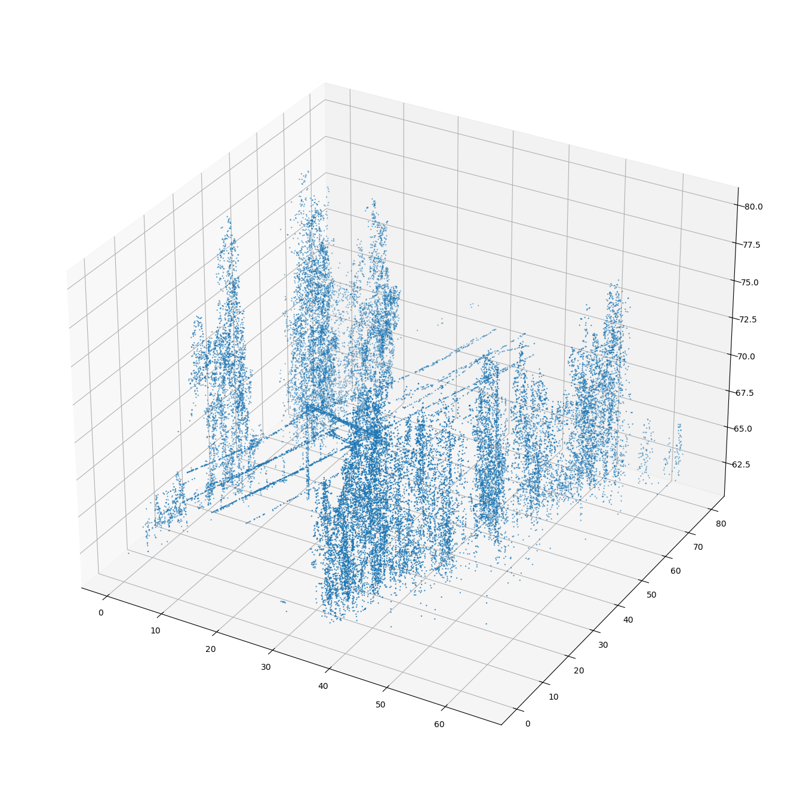

## Optimal EPS value
The optimal epsilon (EPS) value was found using k-Nerest Neighbors (KNN). For the calculations, k=10 was chosen. 

Dataset 1 has an optimal EPS value of eps $\approx$ 1.70.

Dataset 2 has an optimal EPS value of eps $\approx$ 1.23.

To improve the clustering results, a margin of 0.5 was added to both EPS values. This reduces the sensitivity to noise and improves the clustersing performance.

Datasets 1 and 2 does not share the same optimal ESP-value. This is to be expected as it depends on the surrounding area. As the two datasets are takes from different areas, their properties will not be same.

### Knee/elbow graphs
#### Dataset 1
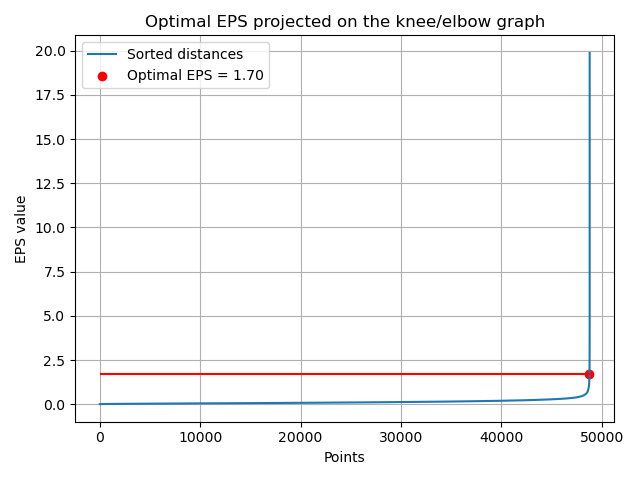

#### Dataset 2
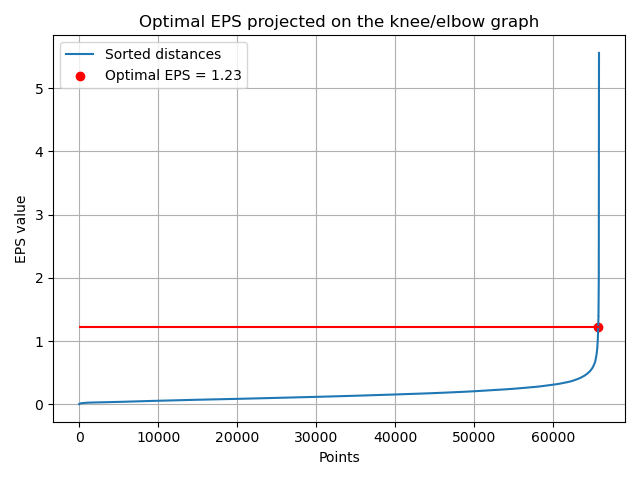

### Clustering graphs
#### Dataset 1 calcualted optimal EPS
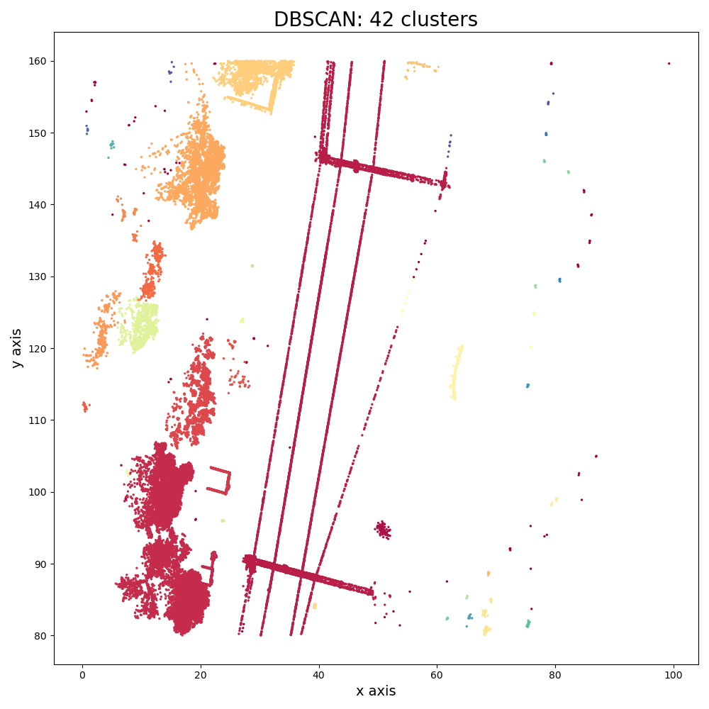

#### Dataset 1 tweaked optimal EPS
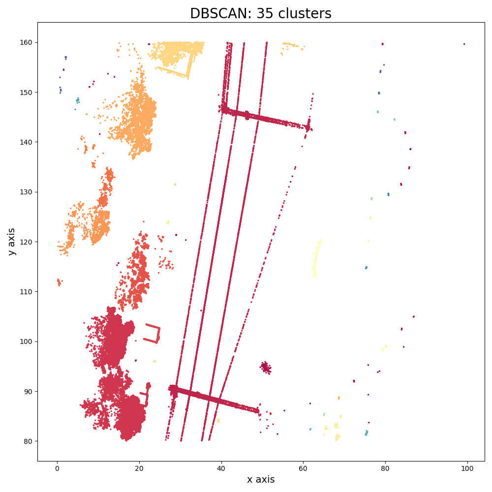

#### Dataset 1 tweaked optimal EPS, 3D
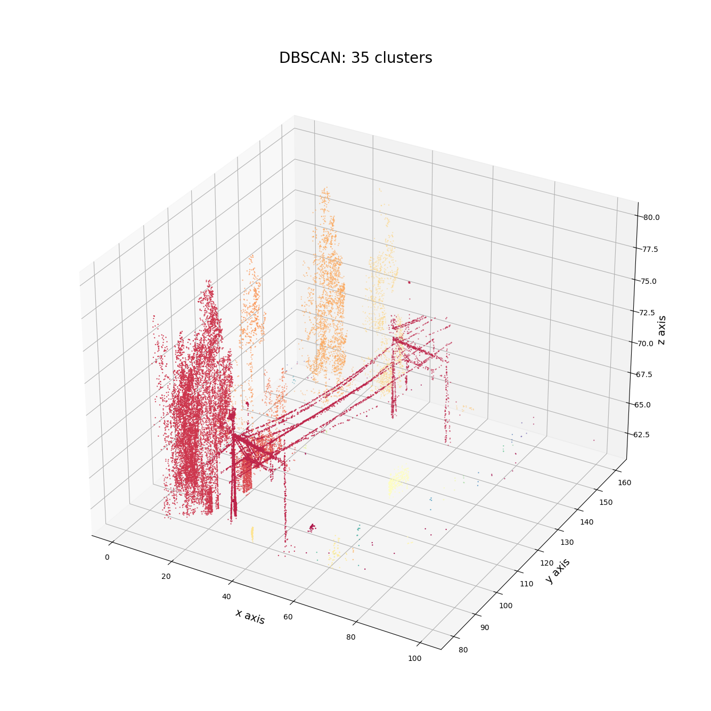

#### Dataset 2 calcualted optimal EPS
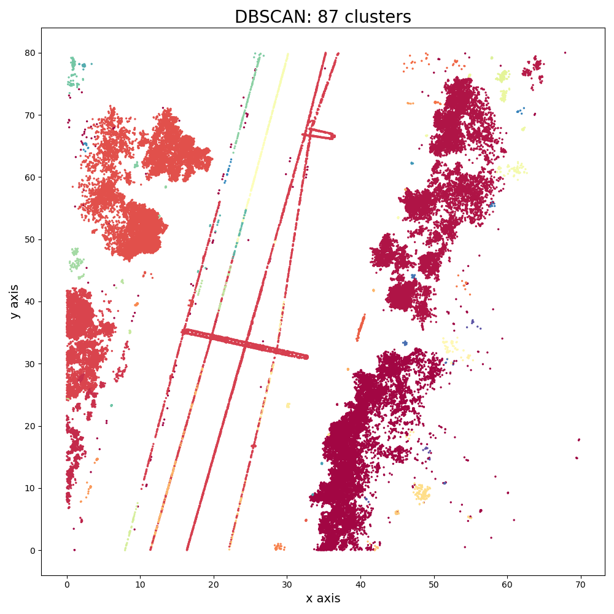

#### Dataset 2 tweaked optimal EPS
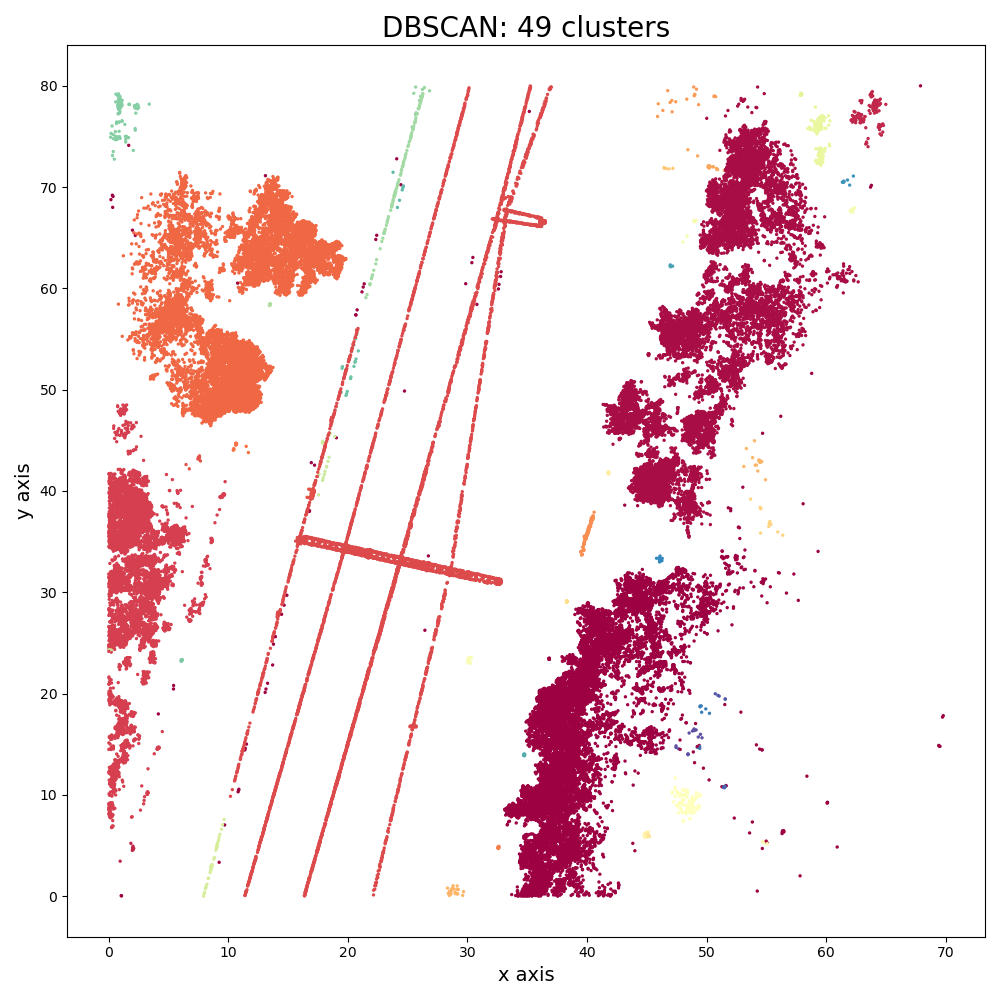

#### Dataset 2 tweaked optimal EPS, 3D
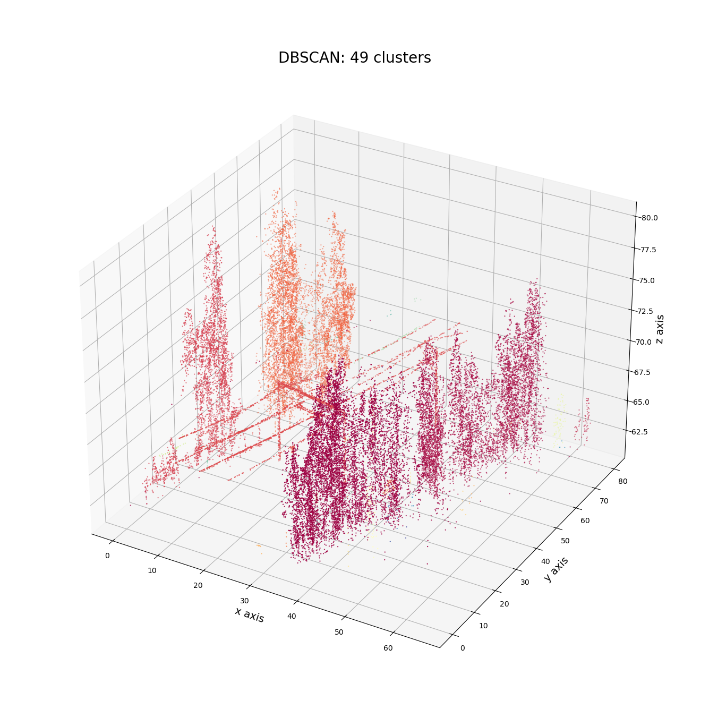